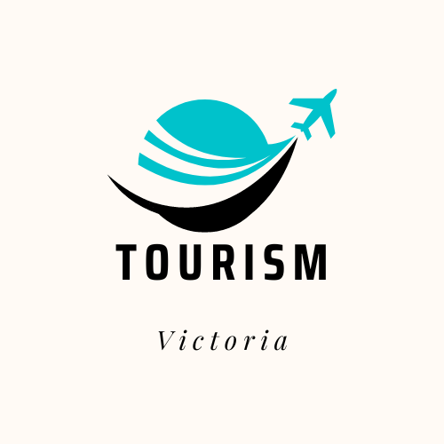
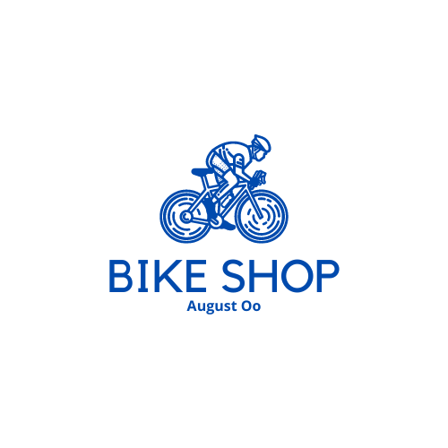

# August Oo's Portfolio

 

Welcome to my portfolio! I'm August Oo, a passionate IT learner who is motivated to explore and learn everything about the world of Information Technology.

## About Me

I am originally from Myanmar and hold a Bachelor of Law (LL.B) degree. After moving to Australia, I decided to follow my passion for IT and am currently pursuing the Diploma of IT at RMIT University in Melbourne. I have managed and created websites and am enthusiastic about expanding my skills to create unique and impactful web experiences.

My journey into the IT industry is driven by a strong motivation to learn, adapt, and contribute to meaningful projects.

## Projects

### [School Project](A1_AugustOo_s4019427/index.html)
- This is my assessment project for web development.
- The project demonstrates my understanding of HTML, CSS, and basic web design principles.

  

### [Java Project - Winter Skii Resort]

  

### [Wordpress Project - BIKE SHOP](http://localhost/testsite/)
- A project created for my Complex ICT content management course.
- Implemented using Wordpress, showcasing my ability to work with content management systems.
   

  

## Keep in Touch

Feel free to get in touch with me:
- Email: augustoo533114@email.com
- Phone: 04149193026
- GitHub: https://augustoo111.github.io/Portfolio/

## Hire Me

If you're seeking a dedicated and passionate individual who is eager to learn and contribute, please consider hiring me. You can find more information in the [Hire Me](hireme.html) section of my portfolio.

## Download My CV

Interested in learning more about my background and skills? You can download my CV [here](images/CV.pdf).

---

Thank you for visiting my portfolio! I look forward to connecting with you.
